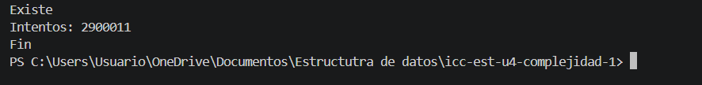

# Práctica: [04.01 Complejidad]

## Datos del Estudiante
- **Nombre:** [Josue Calle]
- **Curso:** [Estructura]
- **Fecha:** [14-04-2026]

---

## 1. [icc-est-u4-complejidad] 

**Fecha: 14-04-2026**

**Descripción:** Creamos el proyecto y subimos a github

---

## 2. icc-est-u4-complejidad

**Descripción:** creamos la clase estuduante y generador y creamos un listado de estudiantes con datos aleatoreos para buscar y optimizar la busqueda

---

## 3. icc-est-u4-complejidad

## 3. icc-est-u4-complejidad

**Fecha:** 15/03/26
**Descripción:** Ejemplos de bucles listados

---